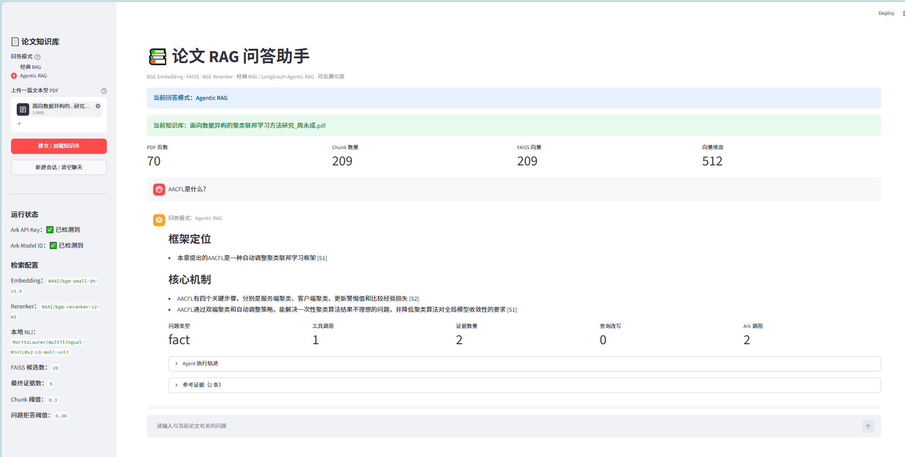
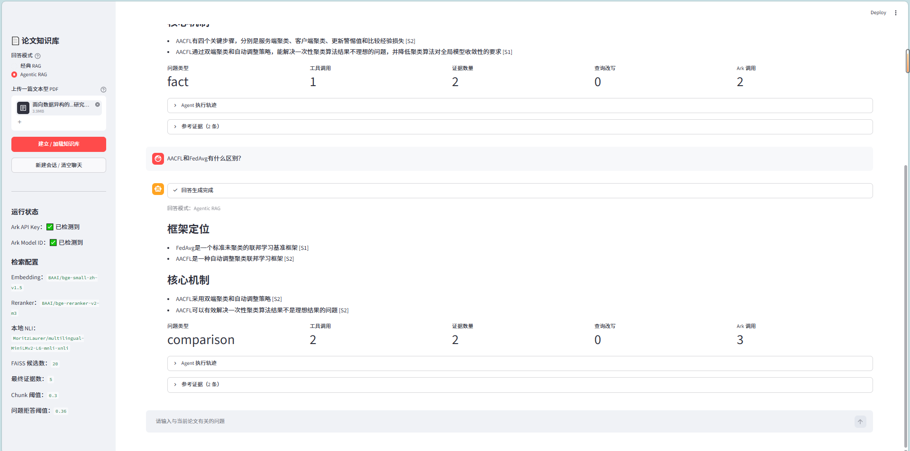
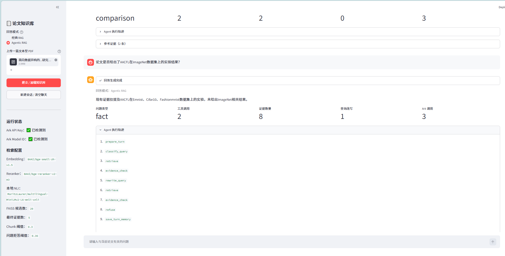
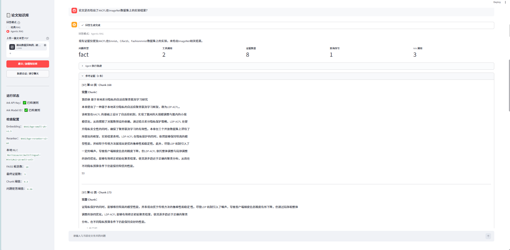

# Agentic Paper Assistant

基于 **LangGraph + RAG + Local NLI** 构建的论文智能问答 Agent。

项目在原始 Paper RAG Assistant 的基础上进一步升级，引入问题路由、比较问题拆解、证据充分性判断、查询改写与二次检索、Claim 级证据校验、本地 NLI 语义验证以及确定性引用编号，实现从传统单链路 RAG 到 Agentic RAG 工作流的完整演进。

用户上传论文 PDF 后，系统可以针对论文内容进行事实问答、方法机制分析、算法比较和指定页面阅读；当首轮证据不足时，Agent 会自动改写查询并重新检索，同时避免重复 Chunk。最终回答由大模型自然组织语言，并通过本地证据校验后生成可回溯引用。

## Features
## Demo

### Agentic Paper Q&A



### Multi-method Comparison



### Evidence-insufficient Retry



### Traceable Evidence



### Agentic RAG Workflow

基于 LangGraph 构建状态化 Agent 工作流，不再使用固定的：

`Retrieve → Generate`

而是根据问题类型和当前证据动态选择执行路径。

当前支持：

* 普通论文事实问答
* 方法机制与流程问答
* 双对象比较问题
* 指定 PDF 页面阅读
* 知识库外问题拒答
* 证据不足自动查询改写
* 最多两轮论文检索
* 多轮会话主题记忆

### Query Routing

系统首先对用户问题进行确定性分类：

```text
fact
method_workflow
comparison
page_read
out_of_scope
```

不同问题进入不同 LangGraph 节点。

比较问题例如：

```text
AACFL 和 FedAvg 有什么区别？
```

会被拆解为两个独立检索子问题，再分别进行论文证据检索和合并。

### Evidence-aware Retrieval Retry

首轮检索后，Agent 会判断当前论文证据是否足以回答问题。

```text
Evidence Sufficient
        │
   ┌────┴────┐
   │         │
  Yes        No
   │         │
Generate   Rewrite Query
             │
          Retrieve Again
```

第二轮检索会：

* 排除已检索过的 Chunk
* 优先保留新增证据
* 合并两轮结果
* 控制最终证据数量

避免查询改写后仍然反复获得完全相同的论文片段。

### Claim-level Grounding

为了同时兼顾回答自然度与引用可靠性，本项目没有要求大模型直接复制论文原文，也没有让模型自行决定最终 `[S1] / [S2]` 编号。

回答流程采用：

```text
LLM Natural-language Claim
        ↓
Stable chunk_id
        ↓
Exact evidence_quote
        ↓
Local Validation
        ↓
Python Citation Assignment
```

每条回答结论均绑定：

```text
claim
chunk_id
evidence_quote
```

其中：

* `claim`：大模型根据证据组织的自然语言结论
* `chunk_id`：原始 RAG Chunk 的稳定身份
* `evidence_quote`：来自对应 Chunk 的连续论文原文

Python 会首先确认：

1. `chunk_id` 是否真实存在
2. `evidence_quote` 是否确实来自指定 Chunk
3. Claim 中的数值是否存在于证据中
4. 方法与数值是否正确绑定
5. 显式高低关系是否与表格数据一致

只有通过验证的 Claim 才能进入最终回答。

### Local NLI Validation

普通定义、机制、流程等自然语言 Claim 会进一步交给本地 NLI 模型进行语义蕴含判断：

```text
Premise   = Evidence Context
Hypothesis = Generated Claim
```

输出：

```text
entailment
neutral
contradiction
```

只有被判定为可靠蕴含的 Claim 才会展示。

对于通用 NLI 不擅长的表格数值和明确大小关系，则由 Python 进行确定性验证，避免正确的数值结论被 NLI 错误删除，也降低数字归属错乱的风险。

### Deterministic Citation Mapping

模型不会生成最终的：

```text
[S1]
[S2]
[S3]
```

模型只绑定稳定 `chunk_id`。

在所有 Claim 验证完成后，Python 根据最终实际使用的 Chunk 统一生成连续引用编号：

```text
Chunk 128 → S1
Chunk 76  → S2
Chunk 91  → S3
```

因此即使部分 Claim 被过滤，最终引用编号仍然保持连续，并且能够稳定映射回真正使用的论文证据。

### Partial Claim Filtering

系统不会因为一条结论引用失败而隐藏整篇答案。

```text
Generated Claims
      ↓
Claim 1 ✓
Claim 2 ✗
Claim 3 ✓
      ↓
Keep Claim 1 + Claim 3
```

如果部分 Claim 验证失败：

* 仅过滤不可靠 Claim
* 保留其他可靠结论

如果全部 Claim 失败：

* 使用同一批证据重新生成一次
* 第二次仍无法通过时再拒答

从而避免因为单条引用问题导致整轮回答完全消失。

## Architecture

```text
                         ┌─────────────────────┐
                         │     User Query      │
                         └──────────┬──────────┘
                                    │
                              prepare_turn
                                    │
                              classify_query
                                    │
              ┌─────────────────────┼──────────────────────┐
              │                     │                      │
            Fact               Comparison              Page Read
              │                     │                      │
           retrieve          decompose_query            read_page
                                    │
                              multi_retrieve
              │                     │                      │
              └─────────────────────┼──────────────────────┘
                                    │
                              evidence_check
                                    │
                         ┌──────────┴──────────┐
                         │                     │
                    Sufficient            Insufficient
                         │                     │
                  generate_claims        rewrite_query
                         │                     │
                  validate_claims            retrieve
                         │                     │
                   render_answer       evidence_check
                         │
                 save_turn_memory
```

## RAG Backend

Agent 层复用了原 Paper RAG Assistant 中已经完成的底层检索能力，包括：

```text
PDF Parsing
    ↓
Recursive Chunking
    ↓
BGE Embedding
    ↓
FAISS Top-K Retrieval
    ↓
BGE Reranker
    ↓
Top Evidence
```

原始 RAG 后端目前保留在：

```text
practice/
```

其中包含 PDF 解析、文本切分、FAISS 检索和 Reranker 等底层模块。

Agent 层通过 `rag_service.py` 和相关 runtime 模块复用该检索能力。

## Project Structure

```text
agentic-paper-assistant/
│
├── app.py
├── logging_utils.py
├── requirements.txt
├── requirements-dev.txt
├── .env.example
│
├── src/
│   ├── agent_graph.py
│   ├── agent_nodes.py
│   ├── agent_prompts.py
│   ├── agent_routes.py
│   ├── agent_service.py
│   ├── agent_state.py
│   ├── agent_tools.py
│   ├── app_config.py
│   ├── claim_grounding.py
│   ├── nli_service.py
│   ├── retrieval_evidence.py
│   ├── runtime_loader.py
│   ├── rag_service.py
│   ├── file_utils.py
│   └── ui_components.py
│
├── practice/
│   ├── day16_faiss_retrieval.py
│   ├── day17_pdf_extraction.py
│   ├── day18_recursive_chunking.py
│   ├── day19_full_retrieval_pipeline.py
│   ├── day22_reranker_rag.py
│   └── day30_real_graph.py
│
├── scripts/
│   ├── run_offline_checks.ps1
│   └── run_real_nli_validation.py
│
├── tests/
│   ├── test_agent_tools.py
│   ├── test_claim_grounding.py
│   ├── test_rag_reliability.py
│   └── test_refactor_regressions.py
│
├── assets/
└── data/
```

## Main Modules

### `agent_graph.py`

定义 LangGraph StateGraph，负责：

* Node 注册
* Edge 连接
* Conditional Edge
* Agent 主流程编排

### `agent_state.py`

维护 Agent 跨节点共享状态，包括：

* 当前问题
* 问题类型
* 检索证据
* 比较对象
* 查询改写状态
* 生成 Claim
* 通过/拒绝 Claim
* 引用映射
* 会话主题
* 执行轨迹

### `agent_nodes.py`

实现 Agent 工作流中的主要节点，例如：

```text
prepare_turn
classify_query
retrieve
multi_retrieve
read_page
evidence_check
rewrite_query
generate_claims
validate_claims
render_answer
save_turn_memory
refuse
```

### `claim_grounding.py`

负责回答 Grounding，包括：

* Claim 结构解析
* Chunk ID 验证
* Evidence Quote 连续原文验证
* Evidence Context 构建
* 数值归属验证
* 数值方向验证
* Claim 过滤
* 最终引用编号生成

### `nli_service.py`

提供本地 NLI 推理能力，用于验证自然语言 Claim 是否被论文证据语义支持。

### `retrieval_evidence.py`

负责：

* 多轮证据去重
* 新旧证据合并
* 第二轮新证据优先保留
* 比较问题双方证据平衡

## Tech Stack

* Python
* LangChain
* LangGraph
* Streamlit
* PyMuPDF
* BGE Embedding
* FAISS
* BGE Reranker
* Hugging Face Transformers
* Local NLI
* Volcengine Ark OpenAI-compatible API
* pytest

## Evaluation

### Offline Regression Tests

当前正式测试：

```text
42 passed
```

覆盖：

* Agent 工具调用
* 检索可靠性
* Chunk / Quote Grounding
* Claim 过滤
* 多 Support 拒绝
* 数值归属
* 方法主体互换
* 高于 / 低于方向
* 二次检索证据保留
* 多轮指代消解
* Conversation Topic Memory
* NLI 调用控制
* Python 确定性表格验证

运行：

```bash
python -m pytest ./tests -q
```

### End-to-end Validation

完成三类真实 Agent 路径验收：

#### 1. 普通论文问答

```text
AACFL 是什么？
```

执行：

```text
prepare_turn
→ classify_query
→ retrieve
→ evidence_check
→ generate_claims
→ validate_claims
→ render_answer
→ save_turn_memory
```

结果：

* 生成自然语言回答
* Claim 级过滤正常
* 引用映射正常

#### 2. 比较问题

```text
AACFL 和 FedAvg 有什么区别？
```

执行：

```text
decompose_query
→ multi_retrieve
→ evidence_check
→ generate_claims
→ validate_claims
→ render_answer
```

结果：

* 自动拆分双方检索查询
* 同时覆盖两个比较对象
* 不可靠 Claim 独立过滤
* Python 最终分配引用编号

#### 3. 证据不足问题

```text
论文是否给出了 AACFL 在 ImageNet 数据集上的实验结果？
```

执行：

```text
retrieve
→ evidence_check
→ rewrite_query
→ retrieve
→ evidence_check
→ refuse
```

系统不会编造不存在的实验结果。

## Installation

### 1. Clone

```bash
git clone <YOUR_REPOSITORY_URL>
cd agentic-paper-assistant
```

### 2. Create Virtual Environment

Windows:

```bash
python -m venv venv
venv\Scripts\activate
```

### 3. Install Dependencies

```bash
pip install -r requirements.txt
```

开发和测试环境：

```bash
pip install -r requirements-dev.txt
```

### 4. Configure Environment Variables

复制：

```text
.env.example
```

为：

```text
.env
```

并填写所需的大模型 API 配置。

不要将真实 `.env` 上传至 GitHub。

### 5. Start

```bash
streamlit run app.py
```

在浏览器中上传论文 PDF，系统会自动建立当前论文知识库。

## Testing

运行全部离线测试：

```bash
python -m pytest ./tests -q
```

运行本地 NLI 专项测试：

```bash
python ./scripts/run_real_nli_validation.py
```

本地 NLI 测试不会调用 Ark API。

## Key Design Decisions

### Why not let the LLM generate citation numbers?

`S1 / S2 / S3` 是展示层编号，不是证据的稳定身份。

如果让模型直接生成引用编号，在证据重新排序、过滤或第二轮检索后容易出现引用错位。

因此本项目内部始终使用：

```text
chunk_id
```

绑定真实证据，最后才由 Python 转换为：

```text
[S1] [S2] [S3]
```

### Why use both Evidence Quote and NLI?

仅验证原文摘录能够证明：

> 这段文字确实来自论文。

但不能完全证明：

> 模型组织后的自然语言结论仍然忠实于这段证据。

因此系统使用：

```text
Exact Quote Validation
+
Semantic Entailment Validation
```

共同控制自然语言回答的 Grounding。

### Why are numeric claims handled separately?

通用 NLI 对表格、数字归属和大小关系并不稳定。

因此对于：

```text
FedAvg = 5116
AACFL = 5831
```

以及：

```text
AACFL > FedAvg
```

等确定性关系，优先通过 Python 对方法—数值绑定和方向关系进行验证，而不是完全依赖语言模型判断。

## Limitations

当前版本仍存在一些工程边界：

* 比较问题主要针对常见双对象比较场景
* 本地 NLI 对复杂公式和部分专业表格推理能力有限
* PDF 表格依赖文本抽取质量
* 当前不支持复杂多页面联合推理
* Query Classification 主要采用确定性规则
* Agent 面向单篇论文知识库，不是多文档科研知识平台

## Evolution

该项目由基础 Paper RAG Assistant 演进而来：

```text
Paper RAG Assistant
        ↓
Retrieval + Reranker
        ↓
Reliable RAG
        ↓
LangGraph Workflow
        ↓
Query Routing
        ↓
Evidence Retry
        ↓
Claim-level Grounding
        ↓
Local NLI
        ↓
Agentic Paper Assistant
```

原基础版本：

`paper-rag-assistant`

当前项目重点展示的是在传统 RAG 基础上进行 Agent 工作流设计、证据控制、状态管理和可靠回答生成的工程实践。

## License

This project is intended for learning, research and portfolio demonstration.
